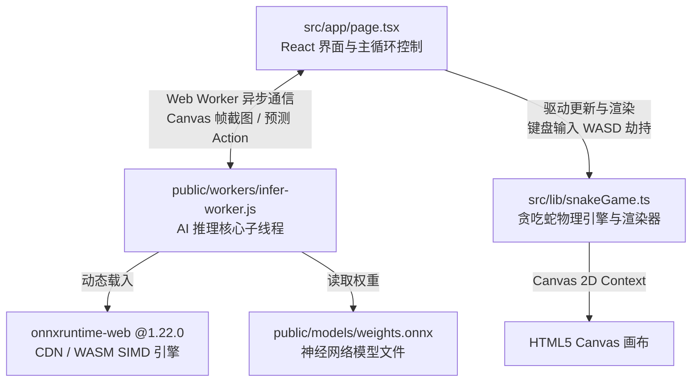

# 🐍 Snake AI - 纯前端强化学习贪吃蛇游戏

这是一个基于 **Next.js + TypeScript** 开发的、结合了**神经网络在线推理 (WebAssembly)** 与传统手动操作的贪吃蛇小游戏。项目最大的特色在于：它通过纯前端架构，在浏览器的 **Web Worker** 中异步运行基于 **ONNX Runtime Web** 的深度强化学习模型（DQN / PPO 神经网络），实现了低延迟、多线程加速的“AI 自动闯关”与“玩家手动游玩”的双模体验。

---

## 📌 项目核心架构快照

项目采用扁平化、高内聚的模块化设计，主要由以下三大部分组成：



---

## 📂 模块详细拆解与职责分工

### 1. 🎮 UI 交互与主循环控制层：`src/app/page.tsx`
该模块是整个应用的“心脏”，负责控制游戏的生命周期、管理用户界面状态，并根据模式分配系统时钟。
* **状态中心**：使用 React 的 `useState` 和 `useRef` 维护游戏得分 (`score`)、模型准备状态 (`ready`)、游戏运行标识等。
* **键盘控制器**：挂载全局 `keydown` 监听器，支持传统的 `WASD` 与 `↑ ↓ ← →` 方向键，改变蛇的前进方向，且智能阻止了方向键导致的浏览器页面滚动。
* **多模态时钟驱动**：
  * **AI 模式**：通过接收 Web Worker 传回的 Action，并在更新画布后利用 `setTimeout` 延迟 `config.moveSpeed` 毫秒，触发下一帧 `requestNextStep`，使 AI 的行进频率与物理时钟严格匹配。
  * **手动模式**：开启一个周期为 `config.moveSpeed` 毫秒的 `setInterval` 定时器，驱动蛇自动前行，实现纯净且流畅的传统贪吃蛇操作。
* **状态互斥清理**：负责在模式切换（Start AI / Start Manual）或游戏重置（Reset）时，彻底销毁另一个模式的定时器与未完成的异步网络帧，确保系统无任何内存泄漏和并发冲突。

### 2. 🧮 游戏物理引擎与渲染器层：`src/lib/snakeGame.ts`
这里是贪吃蛇游戏的规则制定者与画面渲染工具，主要包含了四个细分面向对象的类：
* **`Position`**：基础的二维向量类，管理物理坐标的克隆、相等判断与位移计算。
* **`Snake`**：管理贪吃蛇的身体数组 (`body`)、当前朝向、撞墙检测（`checkWallCollision`）、自身碰撞检测（`checkSelfCollision`）以及吃食成长机制。
* **`Food`**：维护食物的当前坐标，检测蛇头碰撞，并在被吃掉后自动在 10x10 网格内随机重生成。
* **`Renderer`**：管理 HTML5 Canvas 的画布更新，负责清空画布、绘制黑底背景、绘制微弱网格线，并渲染带有**平滑绿度渐变**的蛇身和醒目的红点食物。
* **`SnakeGame`**（主控类）：统筹其余核心类，提供一键重置（重置时**分数清零**）、提供单步物理状态更新方法 `update()`。此外，它还承担着关键的**强化学习特征提取（Feature Extraction）**功能。

### 3. 🧠 AI 异步推理子线程层：`public/workers/infer-worker.js`
为了防止深度学习模型庞大的矩阵乘法拖慢网页的渲染频率（导致游戏卡顿或掉帧），本项目将所有 AI 推理相关的计算彻底隔离在 **Web Worker** 子线程中运行。
* **多线程与 WASM 硬件加速**：
  子线程动态引入了锁定版本的 `onnxruntime-web@1.22.0`。我们在代码中将其 WASM 加速包的路由重定向至 CDN 路径：
  ```javascript
  ort.env.wasm.wasmPaths = 'https://cdn.jsdelivr.net/npm/onnxruntime-web@1.22.0/dist/';
  ```
  这让浏览器能自动激活多线程（Multi-threading）以及 SIMD / JSEP 加速，大幅度降低单帧推理延迟（通常仅需几毫秒）。
* **图像下采样预处理 (`sampleGray`)**：
  子线程接收主线程发来的 400x400 Canvas 位图 (`ImageBitmap`)，通过精妙的灰度提取算法，将其在片上快速缩放降采样至神经网络需要的 **10x10 灰度图矩阵**：
  * 红色食物像素映射为 `1.0`。
  * 蛇身绿色像素根据距离蛇尾的远近映射为 `[0.3, 0.9]` 的渐变浮点值。
  * 空白背景映射为 `0.0`。
* **时间序列堆栈构建**：
  维护了一个长度为 4 帧的灰度画面堆栈 (`frameStack`)，将多帧画面拼接为 `[1, 4, 10, 10]` 的 Tensor 传递给模型，使 AI 拥有检测“蛇身前进趋势与运动轨迹”的时间感知能力。
* **双通道输入决策**：
  模型不仅接收 4 帧堆栈图像 Tensor，还额外接收来自游戏物理引擎提取的 **8 维辅助状态向量**：
  * 食物与蛇头的相对 X, Y 偏差（归一化）。
  * 食物与蛇头的欧式距离。
  * 蛇头周围四个相邻格子的安全性状态（是否是墙壁或蛇身障碍）。
  * 当前蛇身占全图比例。
  经过 `weights.onnx` 双通道推理后输出 4 维动作 Q 值（Up, Down, Left, Right），挑选出最大值所指代的动作，传回给主线程执行。

---

## 🔄 数据流与工作闭环

游戏在 **AI 自动游玩**时的每一帧数据流闭环如下：

```text
 ┌────────────────────────────────────────────────────────┐
 │                                                        │
 ▼                                                        │
[Canvas 画布绘制当前游戏状态]                                    │
 │                                                        │
 │ (createImageBitmap 截取位图)                            │
 ▼                                                        │
[主线程 page.tsx 向 Worker 发送位图与 8 维辅助特征]                 │
 │                                                        │
 │ (postMessage 异步跨线程传输)                              │
 ▼                                                        │
[Worker 接收数据]                                          │
 │                                                        │
 ├─► 1. 运行 sampleGray 对 400x400 位图降采样至 10x10          │
 ├─► 2. 将下采样结果塞入 FrameStack 队列，组成 [1,4,10,10] Tensor │
 └─► 3. 载入 8维辅助特征，运行 ort.InferenceSession.run()    │
                                                          │
                                                          ▼
                                             [模型推理输出 4 个 Action 的 Q 值]
                                                          │
                                                          │ (选取最大 Q 值，如: 3 - 向右)
                                                          ▼
                                             [Worker 向主线程回传动作指令]
                                                          │
                                                          │ (onmessage 接收并 handleAction)
                                                          ▼
                                             [主线程更新蛇身物理坐标，重绘 Canvas]
                                                          │
                                                          │ (延迟 moveSpeed 毫秒)
                                                          └──────────────────────┘
```

---

## 🛠️ 本地开发与启动指南

### 1. 环境准备
确保您的本地已安装了 **Node.js**（推荐 v18+）与对应的包管理器（`npm` / `yarn` / `pnpm`）。

### 2. 启动开发服务器
在项目根目录下，直接运行以下命令：
```bash
# 安装依赖
npm install

# 启动本地开发服务
npm run dev
```
项目默认将在本地 `http://localhost:3000` 端口开启。

### 3. 操作模式说明
* **🤖 开启 AI 模式**：
  点击侧边栏的 **`Start AI`** 按钮。模型文件 `weights.onnx` 将被载入，并在 Worker 中激活 WebAssembly 加速，蛇会自动寻找最佳路径吃掉食物。
* **🕹️ 手动体验模式**：
  点击侧边栏的 **`Start Manual`** 按钮（或在 AI 运行中切换），即可通过键盘的 `W`、`A`、`S`、`D` 键（或方向键 `↑` `↓` `←` `→`）来控制蛇的行进。
* **🔄 重置游戏**：
  点击 **`Reset`** 按钮会同时切断两种运行模式，并将蛇、食物和右侧的得分彻底归零，使游戏返回初始待机状态。
